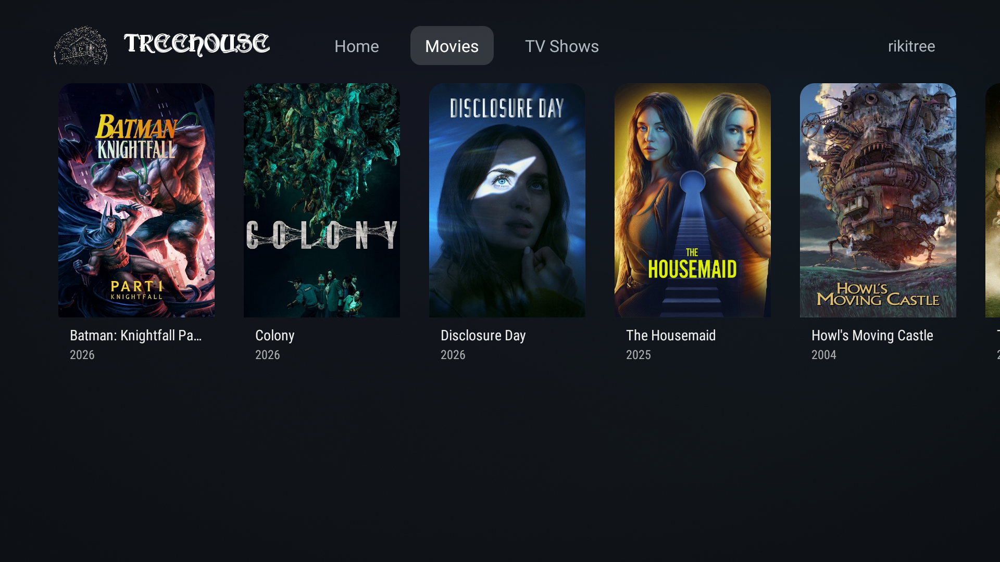

# TreeHouse

**Version 0.2.6** · a personal project, built for one household's own Fire TV Sticks and one
Jellyfin server - not published to any app store, not intended for general distribution.

A native Jellyfin client for Android TV, built specifically to run well on old, low-spec Amazon
Fire TV Stick hardware (1-1.5GB RAM, weak quad-core CPUs). Home and Details are Jetpack Compose for
TV (`androidx.tv.material3`); the Movies/TV Shows library grid and playback screen are still plain
Leanback + a hand-rolled, Apple-TV-inspired transport UI - Leanback stays where its boxier defaults
don't matter (a dense poster grid) and where Compose for TV would have added weight for no visual
benefit, on hardware where that weight is a real cost, not just a style preference.

## Screenshots

| | |
|---|---|
|  |  |
|  |  |
|  | |

*(Screenshot files pending - see note below.)*

## Installing on your Fire TV Stick

The easiest way, with no computer required:

1. On the Fire TV Stick: **Settings -> My Fire TV -> Developer Options** -> turn on **Apps from
   Unknown Sources**. (If you don't see Developer Options, first go to **Settings -> My Fire TV ->
   About** and click on the build number a few times to unlock it.)
2. Install **Downloader** (search for it in the Fire TV's app store - it's free, published by
   AFTVnews).
3. Open Downloader and enter this URL (short, easier to type with a remote):
   ```
   tinyurl.com/25r4a86f
   ```
   (Expands to `https://github.com/RT993/firetv-jellyfin-client/releases/latest/download/TreeHouse.apk`.)
4. Downloader will fetch and install it. Launch **TreeHouse** from the Fire TV home screen.

This link always points at the newest release, so re-entering the same URL in Downloader later
gets you the latest update. See [Releases](https://github.com/RT993/firetv-jellyfin-client/releases)
for the full version history.

If you'd rather install from a machine on the same network via ADB, see
[Building](#building) below.

## Features

- **Server login**: server address entry, username/password, or Quick Connect (approve from
  another already-signed-in Jellyfin app/web page).
- **Home**: a D-pad-pageable hero carousel of trending movies/shows with a crossfading cinematic
  backdrop, a "Pick up where you left off" row, and one poster row per library. A left nav rail
  (Search, Home, one icon per library, Settings) stays out of the way - transparent and icon-only -
  until D-pad focus actually lands on it, then it fades in a background and labels.
- **Details screen**: a split layout - full-bleed backdrop on the right, gradient-masked into a
  poster/title/metadata panel on the left. Technical badges (4K/1080p, Dolby Vision/HDR10/HLG,
  Dolby Atmos/surround) read from the file's actual media streams, a Watchlist toggle backed by
  Jellyfin's own per-user favorite flag, and a soft per-title ambient color glow behind the poster
  (extracted from the poster art via `androidx.palette`).
- **TV series get an inline season picker**: a row of seasons on the details screen swaps the
  episode row below it on the same screen - no separate season-pick screen.
- **Playback**: direct-play when the server says the file's compatible with this device, HLS
  transcode fallback otherwise (see [below](#the-direct-play-vs-transcode-decision)). A custom,
  minimal transport UI (not Leanback's stock boxy controls) over a raw `SurfaceView` - play/pause,
  10s skip back/forward, a thin scrubber, auto-hiding after a few seconds idle - plus **Skip
  Intro** (reads the server's Media Segments data, when a plugin like Intro Skipper provides it)
  and **Play Next** (an "Up Next" prompt in an episode's last 30 seconds, and a persistent
  next-episode button, both auto-resolving the next episode in the season/series).
- **Splash intro**: a short floating-logo animation on launch before handing off to Home (if
  already signed in) or the login flow.

## Tech stack

This app is a deliberate hybrid, not a single-framework build - each screen uses whichever of the
two UI toolkits below fits it better, not the same one everywhere:

- **Home and Details**: Jetpack Compose for TV (`androidx.tv:tv-material`) - `Card`/`Button`/`Text`
  for D-pad-aware focus styling (scale, glow, border on focus), plain `compose-foundation`
  `LazyRow`/`LazyColumn` for the scrolling rows (`androidx.tv:tv-foundation` was tried first, but
  at the pinned version it contains no usable `TvLazyRow`/`TvLazyColumn` at all - see the comment
  in `app/build.gradle.kts`). The left nav rail is hand-built from plain Compose Foundation
  primitives (`Modifier.focusGroup`/`onFocusChanged`, `animateDpAsState`), not
  `NavigationDrawer`/`ModalNavigationDrawer` - both had real, hard-to-verify quirks around
  measuring collapsed-vs-expanded width that cost two rounds of bugs before being replaced.
- **Library grid and Playback**: Kotlin + [androidx.leanback](https://developer.android.com/reference/androidx/leanback/package-summary)
  (`VerticalGridSupportFragment`) for the dense Movies/TV Shows poster grid - a plain grid has no
  real design surface for Compose's focus-styling advantages to matter, so it stays on Leanback's
  lighter widget layer. Playback is a hand-rolled screen (see below), not a Leanback or Compose
  transport UI.
- **Playback**: [Media3/ExoPlayer](https://developer.android.com/media/media3) driving a raw
  `SurfaceView` directly (`ExoPlayer.setVideoSurfaceView`), not Leanback's
  `VideoSupportFragment`/`PlaybackTransportControlGlue` stack - that gets Leanback's stock,
  boxy transport UI out of the way in favor of the custom Apple-TV-style controls described above.
  `androidx.media3.ui.AspectRatioFrameLayout` handles correct letterboxing/pillarboxing, wired
  manually from `Player.Listener.onVideoSizeChanged` since a plain `SurfaceView` doesn't do that
  on its own.
- **Server API**: the official [jellyfin-sdk-kotlin](https://github.com/jellyfin/jellyfin-sdk-kotlin)
  (`org.jellyfin.sdk:jellyfin-core`) for auth, library browsing, media info, and playback URL
  construction. No hand-rolled REST calls.
- **Images**: Glide - `com.github.bumptech.glide:glide` into Leanback's `ImageCardView` on the
  Leanback screens, `com.github.bumptech.glide:compose`'s `GlideImage` on the Compose ones. One
  loader, one disk/memory cache, across both toolkits.
- **`androidx.palette`**: extracts a dominant/vibrant color from a poster for the Details screen's
  ambient glow.
- **Coroutines** (`kotlinx-coroutines-android`) for async server calls, **kotlinx-serialization**
  because jellyfin-sdk-kotlin's models use it.

## Architecture

```
app/src/main/java/io/github/rt993/firetvjellyfin/
├── JellyfinTvApplication.kt        Application entry point; boots JellyfinClientHolder
├── data/
│   ├── JellyfinClientHolder.kt     Process-wide Jellyfin SDK instance + current ApiClient
│   ├── CredentialStore.kt          SharedPreferences: server URL, access token, user id
│   └── JellyfinRepository.kt       App-facing wrapper over the raw SDK calls (auth, browse, playback info)
├── playback/
│   ├── DeviceProfileFactory.kt     Declares this device's playback capabilities to the server
│   └── PlaybackDecisionMaker.kt    The direct-play-vs-transcode decision point (see below)
└── ui/
    ├── splash/   SplashActivity: launcher activity, plays the intro then routes to Home/Login
    ├── login/    Server address -> username/password or Quick Connect (a hand-built step flow,
    │             not GuidedStepSupportFragment)
    ├── home/     HomeScreen (Compose): hero carousel, "Pick up where you left off" row, one poster
    │             row per library, a hand-built left nav rail - see ui/theme/ for shared pieces
    ├── library/  LibraryGridActivity/Fragment: VerticalGridSupportFragment (Leanback) - the
    │             Movies/TV Shows poster grid reached from a Home sidebar item
    ├── details/  DetailsScreen (Compose): split layout, technical badges, ambient poster glow,
    │             inline season/episode picker for a series
    ├── theme/    Shared Compose pieces: TreeHouseTheme (colors), TvCard (the focus scale/glow/
    │             border treatment used by every card), AmbientColor/AmbientGlow (Details' poster glow)
    └── playback/ PlaybackActivity: Media3 ExoPlayer over a raw SurfaceView with a custom
                  transport UI, Skip Intro, and Play Next (see Features above)
```

### The direct-play vs. transcode decision

This is the one architectural point the task called out explicitly, so it's deliberately isolated
rather than inlined into the player:

1. [`playback/DeviceProfileFactory.kt`](app/src/main/java/io/github/rt993/firetvjellyfin/playback/DeviceProfileFactory.kt)
   declares what this app/device claims to support - containers, video/audio codecs, and one HLS
   transcoding fallback profile. This is sent to the server, not decided locally.
2. `JellyfinRepository.getPlaybackInfo()` POSTs that profile to `/Items/{id}/PlaybackInfo`. The
   server matches it against the actual file and answers, per media source, whether it
   `supportsDirectPlay`, `supportsDirectStream`, or only `supportsTranscoding` (with a ready-made
   HLS URL).
3. [`playback/PlaybackDecisionMaker.kt`](app/src/main/java/io/github/rt993/firetvjellyfin/playback/PlaybackDecisionMaker.kt)
   turns that server answer into one concrete, playable URL. This is the single place in the app
   where that choice is made - `PlaybackActivity` never inspects codecs itself, it just hands
   ExoPlayer whatever URL comes out.

The current codec list in `DeviceProfileFactory` is a reasonable generic baseline (H.264/HEVC,
common containers). It is **not** tuned to a specific Fire TV Stick generation - different stick
generations have different hardware decoders (some can't do HEVC or 4K at all). Querying
`MediaCodecList` at runtime and feeding the result into the device profile would make this
decision materially more accurate, and is the natural next step here.

## The minSdk situation

The task this was scaffolded from originally asked for **minSdk 21** (Fire OS 5 / Android 5.1, the
oldest common Fire TV Stick generation), with a note to verify it against the real device. That
verification turned up a hard blocker worth recording:

**As of `androidx.activity:activity:1.12.0-alpha06` (August 2025), AndroidX's own default minSdk
moved from API 21 to API 23 (Android 6.0) project-wide**, and that floor is already baked into the
current stable releases of `androidx.activity` (pulled in transitively by `fragment-ktx`, which
Leanback depends on). Building this project with `minSdk = 21` and today's stable AndroidX
versions fails at manifest-merge time:

```
uses-sdk:minSdkVersion 21 cannot be smaller than version 23 declared in library
[androidx.activity:activity:1.13.0] ... as the library might be using APIs not available in 21
```

So **this project targets `minSdk = 23`**, not 21. Reaching API 21/22 today would mean deliberately
pinning `androidx.activity`, `androidx.fragment`, `androidx.core`, and `androidx.lifecycle` to
versions older than their respective API-23 bumps and accepting unsupported/unpatched library
versions - not worth it here.

**Confirmed against the actual target device**: it reports Fire OS **7.7.1.5**, which is built on
**Android 9 (API 28)** - the Fire TV Stick (2020, 3rd gen) / Fire TV Stick 4K / Fire TV Stick Lite
generation (1.5GB RAM, quad-core 1.7GHz Cortex-A53). `minSdk = 23` comfortably covers this device;
no dependency pinning needed. (minSdk is a floor, not a target - it doesn't need to equal the
device's own API level, just be at or below it. `targetSdk` stays at the current SDK for
up-to-date behavior/APIs.) The hardware is still weak by modern standards, so the lightweight
Leanback + Media3 approach (rather than Compose/Flutter/RN) is still the right call.

## Building

Requires JDK 17+ and the Android SDK (compileSdk/targetSdk 36, build-tools 36.0.0). No local
Android Studio setup is required to build from the command line:

```bash
./gradlew assembleDebug
```

The debug APK lands at `app/build/outputs/apk/debug/app-debug.apk`. Every push of a `v*` tag also
builds this via [`.github/workflows/release.yml`](.github/workflows/release.yml) and publishes it
as a [GitHub release](https://github.com/RT993/firetv-jellyfin-client/releases) - that's what the
Downloader link above points at, and it can also be triggered manually from the Actions tab.

### Installing via ADB instead

1. On the Fire TV Stick: **Settings -> My Fire TV -> Developer Options** -> turn on **ADB
   debugging** and **Apps from Unknown Sources**.
2. Find the Stick's IP address: **Settings -> My Fire TV -> About -> Network**.
3. From a machine on the same network:
   ```bash
   adb connect <fire-tv-ip>:5555
   ./gradlew installDebug
   # or, if you already have the APK:
   adb install -r app/build/outputs/apk/debug/app-debug.apk
   ```
4. Launch it from the Fire TV home screen, or directly via:
   ```bash
   adb shell monkey -p io.github.rt993.firetvjellyfin -c android.intent.category.LEANBACK_LAUNCHER 1
   ```

## Known gaps / next steps

- No automated tests yet.
- The Compose-for-TV screens add real APK weight (Compose runtime + tv-material +
  glide-compose + palette, on top of Leanback/Media3) - this is genuinely a two-toolkit app now,
  not a single lightweight one, in exchange for the design work Compose enabled on Home/Details.
  Worth revisiting if Library grid/Playback ever move to Compose too (drop Leanback) or if the
  weight becomes a real problem on the target hardware.
- `DeviceProfileFactory`'s codec list is generic, not queried from the actual device's
  `MediaCodecList` - see the direct-play/transcode section above.
- Login persists the access token in plain `SharedPreferences` (see `CredentialStore.kt`); move to
  `EncryptedSharedPreferences` before any wider use.
- `usesCleartextTraffic="true"` is set in the manifest because most self-hosted Jellyfin servers on
  a home network are `http://`-only; scope this to a network security config allow-listing trusted
  hosts before a wider release.
- Releases are signed with Gradle's auto-generated debug keystore, not a dedicated release key -
  fine for sideloading, but every install shares the same debug signature. Set up a real signing
  config before distributing this any more widely.
- A harmless manifest-merger warning appears about `org.jellyfin.sdk` being used as the namespace
  by both `jellyfin-platform-android` and `jellyfin-core-android-debug` - that's inside the SDK
  dependency itself, not this app's code.
